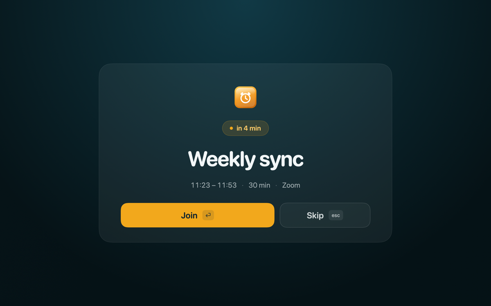

# Call Reminder

**English** · [Русский](README.ru.md)

[](LICENSE)


A macOS menu bar app: it shows the next meeting from Calendar and, a chosen
number of minutes before the call, takes over the whole screen with a window
offering "Join" and "Skip".

Same idea as [In Your Face](https://inyourface.app) — but only the part you need
every day. Works without a network and without accounts: events come from the
system Calendar, which is also what syncs Google, iCloud and Exchange.



## Features

- The next meeting in the menu bar: **time and title**, **title only** or
  **time only** — your pick. When there are no meetings, only the icon is left.
- A full-screen reminder on top of everything, including apps in full-screen
  mode. The counter is live: once the meeting starts, it counts up.
- "Join" opens Zoom straight in the client via `zoomus://`, other services by
  link. Meetings without a link are shown too, with a single "Dismiss" button.
- Choice of calendars, how many minutes ahead to warn, launch at login.

## Installation

Two ways, the same app:

- **Build it yourself** — free, instructions below. Xcode required.
- **Buy it in the Mac App Store** — *coming*: a built and signed version for
  those who would rather not fiddle with Xcode. The link will appear here once
  it ships.

## Building

You need Xcode 26+ and [xcodegen](https://github.com/yonaskolb/XcodeGen)
(`brew install xcodegen`). Optionally
[swiftlint](https://github.com/realm/SwiftLint) — without it the build does not
fail, it only warns.

```sh
make            # build
make test       # run the tests
make check      # format, lint and tests
make install    # build a release and put it into /Applications
```

There is no `.xcodeproj` in the repository: it is generated from `project.yml`
on every build.

### Code signing

By default the build uses an ad-hoc signature — it works, but macOS will ask for
Calendar access again after every rebuild: an ad-hoc signature gets a new cdhash,
so the permission you granted no longer matches.

To make the permission stick, put your own identity into `signing.local`
(it is not tracked by git):

```make
CODE_SIGN_IDENTITY = <SHA-1 from security find-identity -v -p codesigning>
DEVELOPMENT_TEAM = <OU of the same certificate>
```

The Team ID comes from the certificate's `OU` field, not from the parentheses in
its name — those are different values.

## How it works

| File | What it is responsible for |
|---|---|
| `CalendarService` | EventKit: access, reading events until the end of the day, filtering |
| `MeetingLink` | Where the call link sits inside an event and how to open it |
| `ReminderEngine` | When to show the window; ticks once a second by the real clock |
| `AlertPresenter` | The window on top of everything, including someone else's full-screen mode |
| `MenuBarLabel` | Strings for the menu bar and the window |

Logic where a mistake is not visible to the eye lives in pure functions and is
covered by tests; the wrappers around system APIs are checked by running the app.

## What it does not do

- Does not go to the network and does not send calendar data anywhere.
- Does not assemble a deep link for Microsoft Teams: their links are resolved by
  the server, and a locally built `msteams://` opens a help page instead of the
  meeting. The https link is opened instead, and it hands you over to the app
  itself.
- Does not chase meetings that have already started and does not touch all-day
  events.

There is no network entitlement in the app at all, so sending your data anywhere
is not something it is technically capable of. Details: [Privacy Policy](PRIVACY.md).

## License

[MIT](LICENSE). Take it, fork it, patch it, use it at work — no questions asked.

The Mac App Store build costs money, and that is not a contradiction: the money
there is for a finished app and its updates, not for access to the code. If
building it yourself is easier for you — build it, that is exactly what the
license allows.

Zoom, Google Meet, Microsoft Teams, Webex, Whereby, Jitsi, Discord, Slack,
Яндекс Телемост and Контур.Толк are trademarks of their respective owners. The
app only recognizes them in links and is not affiliated with them.
